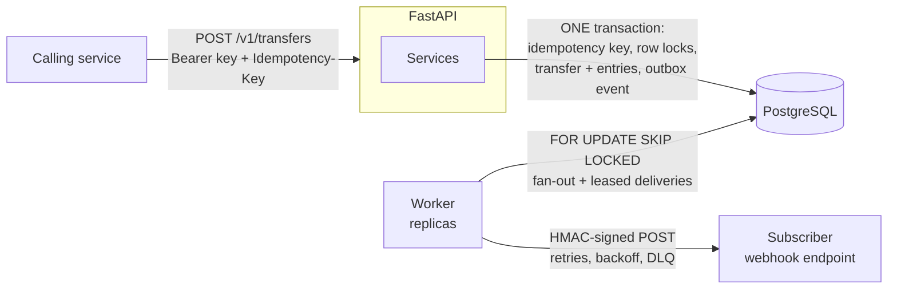

# Ledger Service

[](https://github.com/shivam06062003/ledger-service/actions/workflows/ci.yml)

A payments ledger API built on **double-entry bookkeeping**. Money is never
created or destroyed, only moved between accounts. Every transfer is atomic,
and correctness is enforced both in the application and in PostgreSQL itself.

> **Status:** Phase 4 (events and webhooks) complete. See [Roadmap](#roadmap).

## Architecture



## Highlights

- **No double-spending under concurrency.** Transfers lock both accounts with `SELECT ... FOR UPDATE`, always in ID order to prevent deadlocks. A test fires 50 simultaneous transfers at one account and asserts exactly the affordable number succeed. With the lock removed, the same test shows all 50 succeeding.
- **The database enforces the rules itself:**
  - a `CHECK` constraint blocks overdrafts
  - triggers make ledger rows **append-only**, so history can't be edited
  - a deferred constraint trigger rejects any transfer whose entries don't sum to zero, checked at `COMMIT`
- **Safe retries (idempotency keys).** Every transfer requires an `Idempotency-Key`. The key is claimed in the same transaction as the transfer, so 20 identical concurrent requests produce exactly one transfer; the other 19 get the original response replayed. Failed requests leave no trace and can be retried.
- **Scoped API keys.** Each calling service gets a key with least-privilege scopes. Keys are stored only as SHA-256 hashes, can be revoked instantly, and every transfer records the key that initiated it.
- **Reliable webhooks (transactional outbox).** Events are written in the same transaction as the transfer, so none are lost and none are sent for rolled-back transfers. A separate worker delivers them with HMAC signatures, exponential backoff with jitter, leases (no transaction held during HTTP calls), and a dead-letter queue with manual re-queue. Workers scale horizontally with `FOR UPDATE SKIP LOCKED`. Tests confirm that removing it causes deadlocks.
- **Keyset pagination.** Statements page through `(created_at, id)` cursors backed by a matching index, so page 1,000 is as fast as page 1.
- **Auditable by design:** cached balances for fast reads, immutable entries with `balance_after` for statements, and reconciliation checks that verify the two always agree.
- **Production basics:** Docker Compose, Alembic migrations with round-trip checks in CI, structured JSON logs with request IDs, liveness and readiness probes, strict typing.

## Tech stack

FastAPI · PostgreSQL 17 · async SQLAlchemy 2.0 · Alembic · structlog · pytest · Docker Compose · GitHub Actions

## Quick start

Prerequisites: Docker Desktop, Python 3.12+.

```bash
make up                                    # db + migrations + api
curl localhost:8000/health/ready           # {"status":"ok","database":"ok"}
open http://localhost:8000/docs            # interactive API docs
```

### Try it

```bash
# Bootstrap an admin API key (printed once)
KEY=$(make -s api-key name=demo scopes="admin")
AUTH="Authorization: Bearer $KEY"

# A system account (money entering the ledger) and a customer wallet
FUNDING=$(curl -s localhost:8000/v1/accounts -H "$AUTH" -H 'content-type: application/json' \
  -d '{"name":"Bank settlement","currency":"INR","allow_negative_balance":true}' | jq -r .id)
ALICE=$(curl -s localhost:8000/v1/accounts -H "$AUTH" -H 'content-type: application/json' \
  -d '{"name":"Alice","currency":"INR"}' | jq -r .id)

# Deposit ₹500.00 (amounts are in paise). Run it twice: the second call is
# replayed (header Idempotent-Replayed: true) and no money moves again.
curl -si localhost:8000/v1/transfers -H "$AUTH" -H 'content-type: application/json' \
  -H 'Idempotency-Key: deposit-001' \
  -d "{\"source_account_id\":\"$FUNDING\",\"destination_account_id\":\"$ALICE\",\"amount\":50000,\"currency\":\"INR\"}"

curl -s "localhost:8000/v1/accounts/$ALICE/entries?limit=20" -H "$AUTH" | jq
```

In the interactive docs at `/docs`, click **Authorize** and paste the key.

### Try webhooks

```bash
# Subscribe the bundled example receiver, then start it with the secret
SECRET=$(curl -s localhost:8000/v1/webhook-endpoints -H "$AUTH" -H 'content-type: application/json' \
  -d '{"url":"http://webhook-receiver:9000/webhooks/ledger","event_types":["transfer.created"]}' | jq -r .secret)
WEBHOOK_SECRET=$SECRET docker compose --profile demo up -d webhook-receiver

# Make a transfer (as above), then watch it arrive with a verified signature
docker compose logs -f webhook-receiver
```

Stop the receiver (`docker compose stop webhook-receiver`), make another transfer, and watch the worker schedule retries (`make worker-logs`). Start the receiver again and the delivery succeeds on the next attempt.

### Local development (app outside Docker)

```bash
cp .env.example .env
make install        # .venv with app + dev tools
make db             # Postgres only
make migrate
make check          # lint + typecheck + tests (same as CI)
.venv/bin/uvicorn app.main:app --reload
```

Tests use a separate `ledger_test` database, created and migrated automatically.

## API

All `/v1` endpoints require `Authorization: Bearer <api key>`.

| Method | Path | Scope | Description |
|---|---|---|---|
| `POST` | `/v1/accounts` | `accounts:write` (`admin` for system accounts) | Create an account. Optional `Idempotency-Key` |
| `GET` | `/v1/accounts/{id}` | `accounts:read` | Account with current balance |
| `GET` | `/v1/accounts/{id}/entries` | `accounts:read` | Statement, newest first, cursor-paginated (`limit`, `cursor`) |
| `POST` | `/v1/transfers` | `transfers:write` | Move money atomically. **Requires** `Idempotency-Key` |
| `GET` | `/v1/transfers/{id}` | `transfers:read` | Transfer with its entries and initiating key |
| `POST` | `/v1/api-keys` | `admin` | Issue a key (secret shown once) |
| `DELETE` | `/v1/api-keys/{id}` | `admin` | Revoke a key |
| `POST` | `/v1/webhook-endpoints` | `admin` | Subscribe a URL to event types (signing secret shown once) |
| `GET` | `/v1/webhook-endpoints` | `admin` | List endpoints |
| `DELETE` | `/v1/webhook-endpoints/{id}` | `admin` | Disable an endpoint (history kept) |
| `GET` | `/v1/webhook-deliveries` | `admin` | Delivery log; `?status=failed` is the dead-letter queue |
| `POST` | `/v1/webhook-deliveries/{id}/retry` | `admin` | Re-queue a dead-lettered delivery |

### Webhook events

Events: `transfer.created` and `account.created`. Each delivery is a `POST` with:

```json
{"id": "<event id>", "type": "transfer.created", "created_at": "...", "data": { ...the transfer... }}
```

Headers: `Ledger-Signature: t=<unix>,v1=<hmac>`, `Ledger-Event-Id`, `Ledger-Event-Type`, `Ledger-Delivery-Attempt`.
Delivery is **at-least-once and unordered**. Receivers must verify the signature against the raw body and deduplicate on the event ID. [`examples/webhook_receiver.py`](examples/webhook_receiver.py) shows how; [`app/webhooks/signing.py`](app/webhooks/signing.py) has no app dependencies and can be copied as-is.

Errors use one consistent format:

```json
{"error": {"code": "insufficient_funds", "message": "Account … has insufficient funds"}}
```

## Project layout

```
app/
  api/            HTTP layer: routes, middleware, error mapping (no business logic)
  services/       Business rules and transaction boundaries
  repositories/   Database queries
  models/         SQLAlchemy ORM tables
  schemas/        Pydantic request/response models
  core/           Config, logging, DB engine/session
  webhooks/       Outbox relay, delivery dispatcher, HMAC signing
  worker.py       Background worker process (python -m app.worker)
  cli.py          Operator commands (issue API keys, purge idempotency keys)
migrations/       Alembic migrations (including hand-written triggers)
examples/         Example webhook receiver (signature verification + dedup)
tests/            API, auth, idempotency, webhook, concurrency and DB-integrity tests
docs/adr/         Architecture Decision Records
```

## Roadmap

- [x] **Phase 1: Foundation.** Docker Compose, Alembic, CI, health probes, structured logging.
- [x] **Phase 2: Core ledger.** Accounts, double-entry transfers, row locking, database-enforced invariants, concurrency tests.
- [x] **Phase 3: API hardening.** Idempotency keys, API-key auth with scopes, cursor pagination.
- [x] **Phase 4: Events.** Transactional outbox, relay worker, signed webhooks with retries and a dead-letter queue.
- [ ] **Phase 5: Operability.** Prometheus metrics, OpenTelemetry tracing, rate limiting, load tests, scheduled reconciliation and retention jobs.

## Design decisions

- [ADR 0001: Foundation stack](docs/adr/0001-foundation-stack.md)
- [ADR 0002: Ledger model and concurrency control](docs/adr/0002-ledger-model-and-concurrency.md)
- [ADR 0003: API keys, idempotency and pagination](docs/adr/0003-api-keys-idempotency-pagination.md)
- [ADR 0004: Transactional outbox and webhook delivery](docs/adr/0004-outbox-and-webhooks.md)
